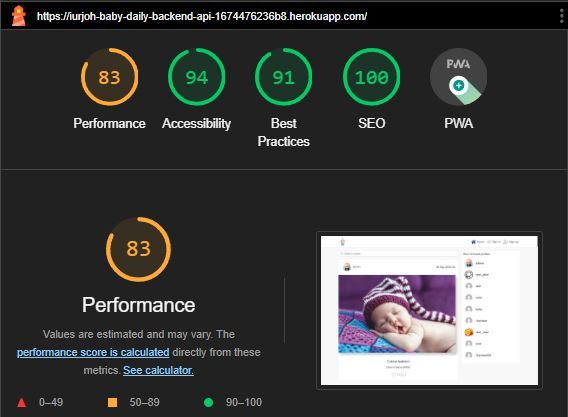
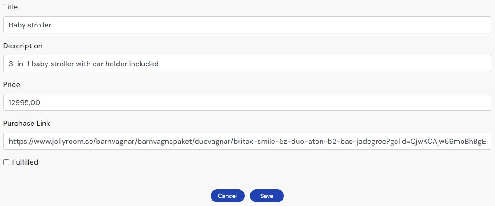

# Baby Daily - Smiles, steps and stories. Daily!

Baby Daily is a responsive website that provides a secure platform for parents to share their baby's milestones, updates, and moments with family and close friends. The platform prioritizes privacy, ensuring that shared content is accessible only to registered users within a trusted circle. Parents can post photos, create wish lists, manage tasks, leave comments, and engage in a private and secure community.


Visit the site [here](https://iurjoh-baby-daily-backend-api-1674476236b8.herokuapp.com/)

## CONTENTS

* [User Experience (UX)](#User-Experience-(UX))
  * [Initial Discussion](#Initial-Discussion)
    * [Key Information for the Site](#Key-Information-for-the-Site)
  * [User Stories](#User-Stories)


* [Design](#Design)
  * [Colour Scheme](#Colour-Scheme)
  * [Typography](#Typography)
  * [Features](#Features)
  * [Future Implementations](#Future-Implementations)

* [Database Schema](#Database-Schema)

* [Technologies Used](#Technologies-Used)
  * [Languages Used](#Languages-Used)
  * [Backend](#Backend)
  * [Authentication and Authorization](#Authentication-and-Authorization)
  * [Frontend](#Frontend)
  * [Database](#Database)
  * [Deployment](#Deployment)
    * [GitHub](#GitHub)
  * [Other Tools and Utilities](#Other-Tools-and-Utilities)

* [Deployment & Local Development](#Deployment-&-Local-Development)
  * [Deployment](#Deployment)
  * [Local Development](#Local-Development)
    * [How to Fork](#How-to-Fork)
    * [How to Clone](#How-to-Clone)

* [Testing](#Testing)
  * [Automated Testing](#Automated-Testing)
    * [W3C Validator](#W3C-Validator)
    * [JavaScript Validator](#JavaScript-Validator)
    * [Lighthouse](#Lighthouse)
  * [Manual Testing](#Manual-Testing)
    * [User Registration](#User-Registration)
    * [User Authentication](#User-Authentication)
    * [Post Interaction](#Post-Interaction)
    * [Comments Management](#Comments-Management)
    * [Profile Functions](#Profile-Functions)
    * [Task List Management](#Task-List-Management)
    * [Wish List Management](#Wish-List-Management)
    * [Navigation and UI Elements](#Navigation-and-UI-Elements)
    * [Asset Management](#Asset-Management)
    * [Infinite Scrolling](#Infinite-Scrolling)
  * [Bugs](#Bugs)    
  
* [Credits](#Credits)
  * [Code Used](#Code-Used)
  * [Content](#Content)
  * [Media](#Media)
  * [Acknowledgments](#Acknowledgments)

- - -

## User Experience (UX)

### Initial Discussion

Baby Daily is a secure online platform designed exclusively for parents to share precious moments, updates, and create a private community with family and friends. Users can post photos, create wish lists, mark tasks, leave comments, like posts, and more, all within their trusted and private circle.

#### Key Information for the Site:

* Safe interactions between parents and their friends and family.
* Space for comments on each photo.
* Like each of the cutest photos and keep your likes list updated.
* A task list for users to track their baby's milestones and activities.
* Parents' wish list with useful products for the baby.
* User area with your photo, brief profile description, your posts, followers and followings.

### User Stories

All User Stories were efficiently organized within the Kanban board available within GitHub itself where the project can be publicly accessed. Strategically all stories were prioritized using MoSCoW technique (acronym MoSCoW stands for “must-have,” “should-have,” “could-have,” and “won't-have"). The Kanban board was divided into three sections to oversee different phases of the project:

* To do: This item hasn't been started yet.
* In Progress: This item is actively being worked on in the Backend and/or Frontend.
* Done: All tasks have been completed.

Here is a list of all my User Stories create for this project:

* View post list: As a **Site User** I can **view a list of posts** so that **I can select one to view and interact**
* Open a post: As a **Site User** I can **click on a post** so that **I can open it and interact**
* View likes: As a **Site User / Admin** I can **view the number of likes on each post** so that **I can see which is the most popular or viral**
* View comments: As a **Site User / Admin** I can **view comments on an individual post** so that **I can read the conversation**
* Account registration: As a **Site User** I **can register an account** so that **I can get access to all functions like post, comments and others**
* Comment on a post: As a **Site User** I can **leave comments on a post** so that **I can be involved in the conversation**
* Like/Unlike: As a **Site User** I can **like or unlike an another user's post** so that **I can interact with the content**
* Manage posts: As a **Site Admin** I can **create, read, update and delete posts** so that **I can manage all posted content**
* Site pagination: As a **Site User** I can **view a paginated list of posts** so that **easily select a post to view**
* Create post: As a **Site User** I can **create a new post when I am logged** so that **I can create new content**
* Edit post: As a **Site User** I can **edit a post when I am logged and be the owner** so that **I can edit a posted content**
* Delete post: As a **Site User** I can **delete a post when I am logged and be the owner** so that **I can delete a posted content**
* View task list: As a **Site User** I can **view a list of tasks** so that **I can select one to view and interact**
* Create task: As a **Site Admin** I can **create a new task when I am logged** so that **I can create new tasks to task list**
* Edit task: As a **Site Admin** I can **edit a task when I am logged** so that **I can edit a task from task list**
* Delete task: As a **Site Admin** I can **delete a task when I am logged** so that **I can delete a task from task list**
* View wish list: As a **Site User** I can **view a list of wishes** so that **I can select one to view and interact**
* Create wish: As a **Site User** I can **create a new wish when I am logged** so that **I can create new wishes to wish list**
* Edit wish: As a **Site User** I can **edit a wish when I am logged and be the owner** so that **I can edit a wish from wishes list**
* Delete wish: As a **Site User** I can **delete a wish when I am logged and be the owner** so that **I can delete a wish from wishes list**
* User profile: As a **Site User** I can **edit my own profile** so that **I can update my photo, description and other details**


- - -

## Design

### Colour Scheme

I tried to use colors based on shades of blue that evoke a newborn. Calm and light colors, which reflect tranquility and security, conducive to this website.
 


### Typography

The font DM Sans, from Google Fonts and linked to San Serif family, was chosen because it is accessible friendly and has a clear and modern style, easy to read and good layout.

I also like to include an image of the fonts chosen as a reference.


- - -

### Features

* Sign Up form: User-friendly form for new users to register and create an account on the platform.
* Sign In form: Secure login interface allowing registered users to access their accounts.
* Comments page: Centralized space displaying comments on various posts, facilitating user engagement.
* Comments create/edit form: Interactive form enabling users to create or modify comments on posts.
* Post page: Dedicated page showcasing individual posts, containing user-generated content.
* Posts page: Dedicated page showcasing all posts, in an infinite scrolling screen.
* Post create/edit form: User-friendly form allowing the creation or modification of posts with associated content.
* Profiles page: Overview of user profiles, providing a snapshot of individual users and their details.
* Popular profiles: Curated list highlighting the most active or influential profiles on the platform.
* Profile edit form: Customizable form enabling users to edit and update their profile information.
* User name form: Form specifically designed for users to set or modify their displayed username.
* Profile page: Comprehensive view of an individual user's profile, aggregating their posts and activities.
* Tasks list page: Centralized view presenting a comprehensive list of tasks, providing an overview of ongoing and completed activities.
* Task create/edit form: User-friendly form facilitating the creation or modification of tasks, ensuring efficient task management.
* Wish list page: Dedicated page displaying a curated collection of user-generated wish lists, offering insights into parents wish list preferences for the baby.
* Wish list create/edit form: Interactive form empowering users to create or edit personalized wish lists, enhancing the user experience in expressing desires and preferences.
* Assets: Tool used in "Add post" for multimedia elements, images, and text used to enhance the visual and interactive aspects of a new post.
* MoreDropDown: Dropdown menu providing additional options or features beyond those readily available, offering a compact and organized navigation experience.
* NavBar: Navigational bar at the top of the page, serving as a visual guide for users to access different sections or features of the platform seamlessly.
* Page not found: Customized page displayed when a user attempts to access a non-existent or unavailable page, providing a clear and user-friendly message indicating the unavailability of the requested content.

### Future Implementations

* Baby Growth Timeline: Develop an interactive growth timeline that visually showcases the baby's developmental milestones.
Include a feature for users to compare their baby's growth with standard developmental milestones.

* Voice and Video Posts: Integrate voice and video post capabilities, allowing users to share audio snippets or video clips of their baby's precious moments.

* Integration with IoT Devices: Explore the possibility of integrating with IoT (Internet of Things) devices, such as baby monitors or smart health devices, to enhance data collection.

* Gamification: Introduce gamification elements to encourage user engagement, such as badges or rewards for completing tasks or reaching milestones.

* Notifications System: Implement a notification system to keep users informed about new comments, likes, or followers. Allow users to customize notification preferences based on their interests.

* Messaging Feature: Integrate a private messaging system for users to communicate directly within the app.
Provide multimedia messaging support, allowing users to share photos and videos privately.

- - -

## Database Schema

This document provides an overview of the structure and relationships to this database. It is designed designed to support parents in sharing private information about their babies with family and close friends, ensuring a space of security and privacy and store and manage data from the precious moments and details of each baby's journey. Parents can use the app to share information such as milestones, health updates, daily tasks, wish list, and memorable events with their trusted circle. It is organized into several tables, each representing a specific entity or relationship within the system.


- - -

## Technologies Used

### Languages Used

* JavaScript ES6
 
* CSS3
 
* Python 3
 
* HTML5

### Backend

* Django (v. 3.2.20): Web framework used for building the backend of the application.
* Django Rest Framework (DRF) (v. 3.14.0) : Powerful and flexible toolkit for building Web APIs in Django.
* Cloudinary  (v. 1.34.0) : Cloud-based media management platform for handling and storing media files.
* dj_database_url (v. 0.5.0): A Django utility to utilize the 12factor inspired DATABASE_URL environment variable to configure your Django application.

### Authentication and Authorization

* dj_rest_auth (v. 2.1.9): Django Rest Framework extension for handling authentication, including JWT-based authentication.
* Allauth (v. 3.2.2): Authentication app for handling user accounts.
* Corsheaders (v. 4.2.0): Django app for handling Cross-Origin Resource Sharing (CORS).

### Frontend

* React: A JavaScript library for building user interfaces.
* React Bootstrap: React components based on Bootstrap for building responsive and mobile-first websites.
* Axios: Promise-based HTTP client for making requests to the backend API.

### Database

* SQLite - Development (v. 0.4.4): Lightweight, file-based database used during development.
* PostgreSQL - Production (v. 2.9.7): Open-source relational database used in production, configured using the dj_database_url package.

### Deployment

* Gitpod: Online integrated development environment (IDE) used for development.
* Heroku: Cloud platform for deploying and hosting the production application.

### Other Tools and Utilities

* Whitenoise (v. 6.4.0): Simplifies serving of static files during production.
* Google Chrome, Microsoft Edge, Mozilla Firefox, Safari: Used for site testing.
* Chrome Dev Tools: Used to test and troubleshoot the webpage as well as fix problems with responsive design and styling.

- - -

## Deployment & Local Development

### Deployment

  __Create Database__

  1. In ElepahantSQL, click "Create New instance" button.
  2. Set up the Tiny Turtle plan, and then select the nearest datacenter to you and click the "Review" button.
  3. Copy the new DATABASE_URL.

  __Connect Cloudinary__

  1. In the terminal: install dj-cloudinary-storage.
  2. And then add CLOUDINARY_URL to the env.py file.
  3. In the settings.py, update the apps to include cloudinary-storage.
  4. Below the import statements in settings, add the following variables for Cloudinary:
```
CLOUDINARY_STORAGE = {
    'CLOUDINARY_URL': os.environ.ger('CLOUDINARY_URL')
}
MEDIA_URL = '/media/'
DEFAULT_FILE_STORAGE = 'cloudinary_storage.storage.MediaCloudinartStorage'
```
  5. Below INSTALLED_APPS in settings, set site ID:
```
SITE_ID = 1
```

  __Create the Heroku App__

  1. On the Heroku dashboard, click the "Create a new app" button.
  2. Go to the config vars in settings and copy paste in the new DATABASE_URL and CLOUDINARY_URL.

  __Connect Project to ElepahantSQL__

  1. In the terminal: install dj_database_url and psycopg2.
  2. In settings.py: import dj-database_url and import os.
  3. Now updated the DATABASES variable to:
```
DATABASES = {
    'default': ({
       'ENGINE': 'django.db.backends.sqlite3',
        'NAME': BASE_DIR / 'db.sqlite3',
    } if 'DEV' in os.environ else dj_database_url.parse(
        os.environ.get('DATABASE_URL')
    )
    )
}
```
  4. Add in the env.py:  
  5. os.environ.setdefault("DATABASE_URL", "<your PostgreSQL URL here>")
  6. Temporarily comment out the environment variable to connect gitpod to your external database.
  7. In ElepahantSQL browser, check if the database is now connected.
  8. If connected, migrate the database and then create a superuser.

  __Deploy on Heroku__

  *In gitpod workspace*

  1. In the terminal, install gunicorn.
  2. Remeber to update the requirements.txt file.
  3. Now create the Procfile.
  4. In settings.py 

   - Add the Heroku app to the ALLOWED_HOSTS variable:
    ```
    os.environ.get('ALLOWED_HOST'),
    'localhost',
    ``` 
    - Add corsheaders to INSTALLED_APPS
    - Add corsheaders middleware to the top of MIDDLEWARE:
  ```
  'corsheaders.middleware.CorsMiddleware',
  ```
- Set ALLOWED_ORIGIN to make network requests
- Below BASE_DIR, create the REST_FRAMEWORK, and include page pagination to improve app loading times, pagination count, and date/time format:
  ```
  REST_FRAMEWORK = {
      'DEFAULT_AUTHENTICATION_CLASSES': [(
          'rest_framework.authentication.SessionAuthentication'
          if 'DEV' in os.environ
          else 'dj_rest_auth.jwt_auth.JWTCookieAuthentication'
      )],
      'DEFAULT_PAGINATION_CLASS':
          'rest_framework.pagination.PageNumberPagination',
      'PAGE_SIZE': 10,
      'DATETIME_FORMAT': '%d %b %Y',
  }
  ```
    - Set the default renderer to JSON:
  ```
  if 'DEV' not in os.environ:
      REST_FRAMEWORK['DEFAULT_RENDERER_CLASSES'] = [
          'rest_framework.renderers.JSONRenderer',
      ]
  ```
    - Add the following, setting the JWT_AUTH_SAMESITE to 'None'
  ```
  REST_USE_JWT = True
  JWT_AUTH_SECURE = True
  JWT_AUTH_COOKIE = 'my-app-auth'
  JWT_AUTH_REFRESH_COOKIE = 'my-refresh-token'
  JWT_AUTH_SAMESITE = 'None'
  ```
    - Remove the value for SECRET_KEY and replace with: SECRET_KEY = os.getenv('SECRET_KEY')
    - Below ALLOWED_HOST, added the CORS_ALLOWED variable.
  ```
  if 'CLIENT_ORIGIN' in os.environ:
    CORS_ALLOWED_ORIGINS = [
        os.environ.get('CLIENT_ORIGIN')
    ]

  if 'CLIENT_ORIGIN_DEV' in os.environ:
      extracted_url = re.match(r'^.+-', os.environ.get('CLIENT_ORIGIN_DEV', ''), re.IGNORECASE).group(0)
      CORS_ALLOWED_ORIGIN_REGEXES = [
          rf"{extracted_url}(eu|us)\d+\w\.gitpod\.io$",
      ]
  ```
    - Set the debug value to True if the DEV environment variable exists:
  ```
  DEBUG = 'DEV' in os.environ
  ```

  5. In env.py
  - Add SECRET_KEY
  - Comment DEV back in 
  6. Update the requirements.txt file
  7. Migrate the database
  8. Add, commit and push the code to github 

  *In Heroku*
  1. Add SECRET_KEY, ALLOWED_HOST, CLIENT_ORIGIN and CLIENT_ORIGIN_DEV to the config vars
  2. Then manually re-deploy the app to github.

#### GitHub

Github Pages was used to deploy the live website. The instructions to achieve this are below:

1. Log in (or sign up) to Github.
2. Find this project at github.com/iurjoh/bd_backend.
3. Click on the Settings link.
4. Click on the Pages link in the left hand side navigation bar.
5. In the Source section, choose main from the drop down select branch menu. Select Root from the drop down select folder menu.
6. Click Save. Your live Github Pages site is now deployed at the URL shown.

### Local Development

#### How to Fork

To fork the Bully-Book-Club repository:

1. Log in (or sign up) to Github.
2. Go to the repository for this project, iurjoh/bd_backend.
3. Click the Fork button in the top right corner.

#### How to Clone

To clone the iurjoh/bd_backend repository:

1. Log in (or sign up) to GitHub.
2. Go to the repository for this project, iurjoh/bd_backend.
3. Click on the code button, select whether you would like to clone with HTTPS, SSH or GitHub CLI and copy the link shown.
4. Open the terminal in your code editor and change the current working directory to the location you want to use for the cloned directory.
5. Type 'git clone' into the terminal and then paste the link you copied in step 3. Press enter.

- - -

## Testing

### Automated Testing

#### W3C Validator

[W3C](https://validator.w3.org/) was used to validate the HTML on all pages of the website. It was also used to validate the CSS. After checking the entire Baby Daily code there were no errors or warnings to show, therefore the code is validated.


#### JavaScript Validator

[jshint](https://jshint.com/) was used to validate the JavaScript adn all code create during development and deployment.

#### Lighthouse

We used Lighthouse within the Chrome Developer Tools to test the performance, accessibility, best practices and SEO of the website.

-  Desktop Results

Overall, the lighthouse scores are very good. A future implementation would be consider opportunities described in the performance analysis with a view to improving the score, which, despite being good, could be even better. All other areas evaluated were very successful.



-  Mobile Results

With a considerable margin of improvement, it would be possible to develop a project with a slightly higher performance rating if this project:
* Serves images in next-gen formats
* Properly sized images
* Efficiently encode images
* Enable text compression


### Manual Testing

#### User Registration:
  * Ensure the sign-up form is user-friendly and includes necessary fields.
  * Verify that users can successfully register an account on the platform.
  * Check for proper error messages when there are validation issues during registration.


#### User Authentication:
  * Confirm that the sign-in form provides a secure login interface.
  * Validate that registered users can log in successfully.
  * Verify that incorrect login credentials result in appropriate error messages.


#### Post Interaction:
  * View post list and confirm the display of a curated list of posts.
  * Open a post and ensure it opens correctly, displaying associated content.
  * Verify that users can interact with posts, such as liking or leaving comments.

  

#### Comments Management:
  * Access the comments page to see a centralized space displaying comments.
  * Utilize the comments create/edit form to create and modify comments on posts.
  * Confirm that comments are correctly displayed on individual post pages.

  

#### Profile Functions:
  * Navigate to the profiles page to view an overview of user profiles.
  * Check the popular profiles list for highlighting active or influential users.
  * Use the profile edit form to customize and update user profile information.
  * Verify the proper functioning of the user name form for setting or modifying displayed usernames.
  * Confirm that the profile page aggregates individual user posts and activities accurately.

  

  

#### Task List Management:
  * Visit the tasks list page to view a comprehensive list of tasks.
  * Use the task create/edit form to create and modify tasks efficiently.
  * Ensure tasks are correctly displayed, providing an overview of ongoing and completed activities.


#### Wish List Management:
  * Access the wish list page to view a curated collection of user-generated wish lists.
  * Use the wish list create/edit form to create and modify personalized wish lists.
  * Verify that wish lists offer insights into parents' preferences for baby-related items.




#### Navigation and UI Elements:
  * Confirm the presence and functionality of the NavBar for seamless navigation.
  * Test the MoreDropDown menu for providing additional options or features.
  * Verify that the page not found is displayed appropriately for non-existent or unavailable pages.
  * Test the search bar for responsiveness and if allows users to input search queries.
  * Test most folloed profiles adding and removing a user from the list using follow/unfollow button.


#### Asset Management:
  * Test the tool used for adding multimedia elements, images, and text to new posts.
  * Confirm that assets enhance the visual and interactive aspects of a new post.


#### Infinite Scrolling:
  * Scroll through the posts page to ensure infinite scrolling works smoothly.
  * Confirm that additional posts load seamlessly as the user scrolls down the page.

### Bugs

All bugs found during development were resolved through decoding, code cleaning, refactoring and restructuring, also was used comparison and typing error tools, forums and help from slack and the Code Institute tutor website.

- - -

## Requirements

* asgiref==3.7.2
* cloudinary==1.34.0
* dj-database-url==0.5.0
* dj-rest-auth==2.1.9
* Django==3.2.20
* django-allauth==0.44.0
* django-cloudinary-storage==0.3.0
* django-cors-headers==4.2.0
* django-filter==23.2
* djangorestframework==3.14.0
* djangorestframework-simplejwt==5.3.0
* gunicorn==21.2.0
* oauthlib==3.2.2
* Pillow==8.2.0
* psycopg2==2.9.7
* PyJWT==2.8.0
* python3-openid==3.2.0
* pytz==2023.3
* requests-oauthlib==1.3.1
* sqlparse==0.4.4
* urllib3==1.26.16
* whitenoise==6.4.0

- - -

## Credits

### Code Used

- Code Institutes 'Django Rest Framework Walkthrough Videos'
- Code Institutes 'Moments Walkthrough Videos'

### Content

- [Stack Overflow](https://stackoverflow.co/) were used at various times to clear up recurring doubts;
- [Code Institute](https://learn.codeinstitute.net/) to review material of study explanatory videos and guides on how to set up a complete website;
- [GitHub](https://github.com/) to better understand other projects;
- [Google](https://www.google.com) for more information on subjects related to the that I had to study during the creation of the site;
- [Youtube](https://www.youtube.com/) tutorials to learn using in a practical way some of the methods necessary to implement the desired functions for the blog;
- [Pycodestyle](https://pypi.org/project/pycodestyle/) used to validade my python code;
- [Flake8](https://flake8.pycqa.org/en/latest/) used to test my pyhton code at local terminal;
- [CI Python Linter](https://pep8ci.herokuapp.com/#) used to test if my pyhton code it complies with PEP8;
- [Extends Class](https://extendsclass.com/python-tester.html) used to test my python code syntax;
- [JSFiddle](https://jsfiddle.net/) used to test my few lines of JavaScript in this project;
- [Slack](https://slack.com/) communities to ask questions and access answers to questions that I found in the development of the site;
- [Django Documentation](https://docs.djangoproject.com/en/4.1/) to access all the documentation implemented in this project including models, views, etc;
- [Django Social Share](https://pypi.org/project/django-social-share/) to access all the documentation to implement share buttons function;
- [Django Allauth](https://django-allauth.readthedocs.io/en/latest/) to access all the documentation to implement authentication and authorization functions;
- [Django Bootstrap Icons](https://pypi.org/project/django-bootstrap-icons/) to access all the documentation to implement the use of the icons that are inside the share buttons;
- [Font Awesome](https://fontawesome.com/icons) to get icons for this project;
- [Coolors](https://coolors.co/) for inspiration about color palettes;
- [Bootstrap Icons](https://icons.getbootstrap.com/) to get icons for this project;
- [Bootstrap Documentation](https://getbootstrap.com/docs/4.0/getting-started/introduction/) to access all the documentation to use many of Bootstrap shortcuts;
- [Kera Cudmore](https://github.com/kera-cudmore/readme-examples/blob/main/milestone1-readme.md) as an exampel of a good README file structure.

## Media

- [Am I Responsive](https://ui.dev/amiresponsive) Multi Device Website Mockup Generator was used to generate the image used in this README.md in the opening section.

## Acknowledgements
- My mentor for continuous helpful feedback.