# Baby Daily - Sorrisos, passos e histórias. Todos os dias!

**Português (Brasil)** | [English](README.md)

Baby Daily é um projeto full stack responsivo para pais compartilharem marcos, novidades e momentos do bebê com familiares e amigos. Inclui fotos, listas de desejos, tarefas, comentários, curtidas e perfis.

**Revisão de documentação:** 01/10/2026. Este documento traduz o registro original do projeto e distingue esse histórico do que foi conferido agora. Os testes históricos não foram executados novamente nesta revisão.

> **Privacidade: intenção não é garantia.** O projeto foi pensado para um círculo de confiança, mas o código atual de `posts/views.py` permite leitura anônima com `IsAuthenticatedOrReadOnly`; a permissão `IsOwnerOrReadOnly` também permite métodos de leitura sem verificar participação em um círculo. Não use dados reais de crianças antes de revisar as permissões, o acesso à mídia e a política de privacidade. Esta atualização não altera o aplicativo nem confirma a segurança de um deploy.

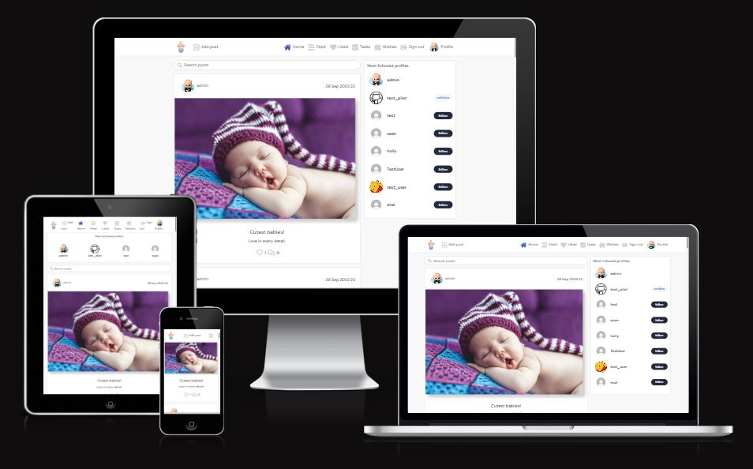

O README original indica https://iurjoh-baby-daily-backend-api-1674476236b8.herokuapp.com/ como endereço do site. Esse endereço e seu endpoint `/api/posts/` responderam HTTP 404 com a página Heroku "No such app" em 01/10/2026; nenhum dado de publicações foi retornado nessa checagem anônima. Isso não descarta outra hospedagem que não esteja documentada aqui.

## Sumário

- [Experiência do usuário](#experiência-do-usuário)
- [Design](#design)
- [Esquema do banco de dados](#esquema-do-banco-de-dados)
- [Arquitetura e tecnologias](#arquitetura-e-tecnologias)
- [Testes](#testes)
- [Deploy e desenvolvimento local](#deploy-e-desenvolvimento-local)
- [Dependências do backend](#dependências-do-backend)
- [Créditos](#créditos)
- [Licença e próximos passos](#licença-e-próximos-passos)

## Experiência do usuário

### Discussão inicial

A ideia original era criar uma comunidade privada onde pais pudessem postar fotos, criar listas de desejos, acompanhar tarefas e interagir com familiares e amigos por comentários e curtidas. Essa é a intenção registrada no projeto, não uma comprovação de isolamento dos dados na implementação atual.

### Informações principais

- Interação entre pais, amigos e familiares.
- Espaço para comentários em cada foto.
- Curtidas nas fotos e uma lista de publicações curtidas.
- Lista de tarefas para acompanhar marcos e atividades do bebê.
- Lista de desejos com produtos úteis para o bebê.
- Área de usuário com foto, descrição, publicações, seguidores e pessoas seguidas.

### Histórias de usuário

O registro original descreve a organização das histórias em um quadro Kanban no GitHub, com priorização MoSCoW: obrigatório, recomendado, opcional e fora do escopo. As colunas eram "To do" (não iniciado), "In Progress" (em trabalho no backend e/ou frontend) e "Done" (concluído). O estado atual do quadro não foi auditado nesta revisão.

| História | Papel e necessidade | Resultado esperado |
| --- | --- | --- |
| Ver lista de publicações | Usuário: ver uma lista de publicações | Escolher uma publicação para abrir e interagir |
| Abrir publicação | Usuário: clicar em uma publicação | Abrir o conteúdo e interagir |
| Ver curtidas | Usuário/administrador: ver o número de curtidas | Identificar publicações mais populares |
| Ver comentários | Usuário/administrador: ver comentários de uma publicação | Ler a conversa |
| Criar conta | Usuário: registrar uma conta | Acessar publicação, comentários e outras funções |
| Comentar | Usuário: deixar comentário | Participar da conversa |
| Curtir/descurtir | Usuário: curtir ou remover curtida | Interagir com o conteúdo |
| Gerenciar publicações | Administrador: criar, ler, editar e excluir | Gerenciar o conteúdo publicado |
| Paginação | Usuário: ver lista paginada | Escolher uma publicação com facilidade |
| Criar publicação | Usuário autenticado: criar publicação | Adicionar conteúdo |
| Editar publicação | Usuário autenticado e dono: editar | Alterar o conteúdo publicado |
| Excluir publicação | Usuário autenticado e dono: excluir | Remover o conteúdo publicado |
| Ver tarefas | Usuário: ver lista de tarefas | Selecionar uma tarefa e interagir |
| Criar tarefa | Administrador autenticado: criar tarefa | Adicionar à lista |
| Editar tarefa | Administrador autenticado: editar | Alterar tarefa da lista |
| Excluir tarefa | Administrador autenticado: excluir | Remover tarefa da lista |
| Ver desejos | Usuário: ver lista de desejos | Selecionar um desejo e interagir |
| Criar desejo | Usuário autenticado: criar desejo | Adicionar à lista |
| Editar desejo | Usuário autenticado e dono: editar | Alterar desejo da lista |
| Excluir desejo | Usuário autenticado e dono: excluir | Remover desejo da lista |
| Perfil | Usuário: editar o próprio perfil | Atualizar foto, descrição e outros detalhes |

Os papéis acima reproduzem o planejamento original; não representam uma auditoria das permissões de cada endpoint.


## Design

### Paleta de cores

O autor escolheu tons de azul associados a um recém-nascido, com cores claras e calmas para transmitir tranquilidade e segurança visual.

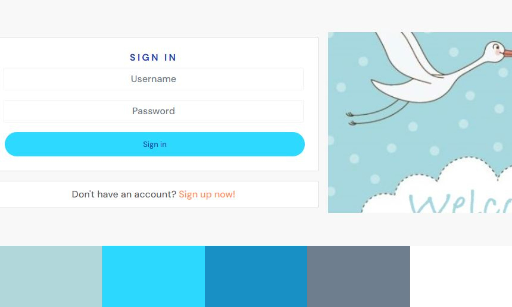

### Tipografia

DM Sans, do Google Fonts, foi escolhida como fonte sem serifa de leitura clara e aparência moderna. O registro original inclui a imagem da fonte como referência de design.

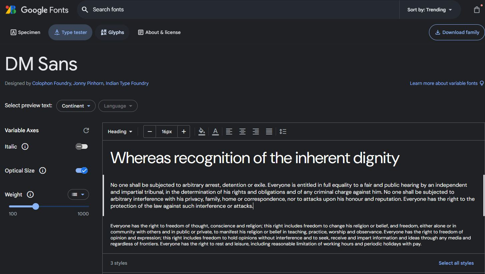

### Funcionalidades registradas

- **Cadastro:** formulário para registrar uma conta.
- **Login:** formulário de entrada para usuários registrados.
- **Comentários:** página de comentários e formulário de criação/edição.
- **Publicação individual:** página com o conteúdo de uma publicação.
- **Feed:** lista de publicações com rolagem infinita.
- **Criar/editar publicação:** formulário de conteúdo e mídia.
- **Perfis:** visão geral dos usuários e lista de perfis populares.
- **Editar perfil:** formulário para foto, descrição e informações pessoais.
- **Nome de usuário:** formulário para alterar o nome exibido.
- **Perfil individual:** reúne publicações e atividades do usuário.
- **Tarefas:** lista e formulário de criação/edição de tarefas.
- **Desejos:** lista e formulário de criação/edição de desejos dos pais.

### Componentes React reutilizáveis

| Componente | Função registrada |
| --- | --- |
| Assets | Elementos de mídia, imagens e texto usados ao adicionar publicações |
| MoreDropDown | Menu com opções adicionais, como edição e exclusão |
| NavBar | Navegação entre as áreas do aplicativo |
| Page not found | Página para endereços inexistentes |
| Avatar | Ícone ou imagem do usuário, acompanhado do nome em áreas do aplicativo |

### Implementações futuras do planejamento original

Estas ideias eram propostas, não funcionalidades confirmadas:

- **Linha do tempo de crescimento:** exibir marcos do bebê e permitir comparação com referências de desenvolvimento.
- **Voz e vídeo:** permitir publicações com áudio e vídeo.
- **Dispositivos IoT:** explorar integração com monitores de bebê ou dispositivos de saúde.
- **Gamificação:** recompensas e distintivos por tarefas e marcos.
- **Notificações:** avisos de comentários, curtidas e seguidores, com preferências individuais.
- **Mensagens privadas:** comunicação dentro do aplicativo com suporte a mídia.

Qualquer futura coleta de informações de saúde, áudio, vídeo ou dispositivos precisa de uma revisão de privacidade própria antes da implementação.

## Esquema do banco de dados

O projeto organiza publicações, perfis, comentários, curtidas, seguidores, tarefas e desejos em aplicações Django separadas. O diagrama original abaixo registra entidades e relações planejadas para os momentos e atividades do bebê.

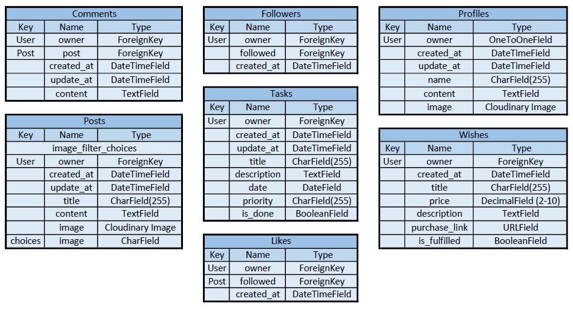

O propósito declarado de compartilhar informações num círculo de confiança não substitui regras de acesso no backend.

## Arquitetura e tecnologias

```text
Navegador -> frontend React -> API Django REST Framework
                            -> banco de dados (SQLite em DEV; DATABASE_URL fora de DEV)
                            -> Cloudinary para mídia
```

### Linguagens

JavaScript ES6, CSS3, Python 3 e HTML5.

### Backend

- Django 3.2.20: framework do backend.
- Django REST Framework 3.14.0: API.
- Cloudinary 1.34.0 e django-cloudinary-storage 0.3.0: armazenamento de mídia.
- dj-database-url 0.5.0: configuração de banco pela variável `DATABASE_URL`.

### Autenticação e autorização

- dj-rest-auth 2.1.9: autenticação, incluindo JWT.
- django-allauth 0.44.0: contas e registro. O texto original confundia a versão; este número vem de `requirements.txt`.
- django-cors-headers 4.2.0: CORS.
- `IsOwnerOrReadOnly`: edição/exclusão por dono, mas leitura liberada para métodos seguros. Não implementa um círculo privado.

### Frontend

De `frontend/package.json`: React 17, React Bootstrap 1.6, Bootstrap 4.6, Axios, React Router 5, `jwt-decode`, `react-infinite-scroll-component`, Create React App (`react-scripts` 4.0.3), Testing Library e MSW. O pacote declara Node 16.x e proxy de desenvolvimento em `http://localhost:8000/`.

### Banco de dados

`bd_backend/settings.py` usa SQLite quando `DEV` existe no ambiente e `dj_database_url.parse(DATABASE_URL)` fora desse modo. O registro original descreve PostgreSQL em produção. `psycopg2==2.9.7` é a versão do driver Python, não do servidor PostgreSQL; a versão do servidor não foi verificada.

### Ferramentas e hospedagem no registro original

- Gitpod: ambiente de desenvolvimento.
- Heroku: hospedagem descrita na documentação histórica.
- WhiteNoise 6.4.0: arquivos estáticos.
- Chrome, Edge, Firefox e Safari: navegadores citados nos testes históricos.
- Chrome DevTools: testes e investigação de responsividade.

As versões registradas são antigas. A lista é documentação do projeto, não uma recomendação para um novo deploy sem revisão de dependências.

## Testes

**Escopo desta revisão:** leitura do README e dos arquivos de configuração, dependências e permissões de publicações. Nenhuma suíte, validação ou medição Lighthouse foi executada novamente em 01/10/2026.

### Validações históricas

#### W3C

O registro original relata validação de HTML e CSS com [W3C](https://validator.w3.org/), sem erros ou avisos ao final. O screenshot abaixo é evidência histórica, não resultado novo.

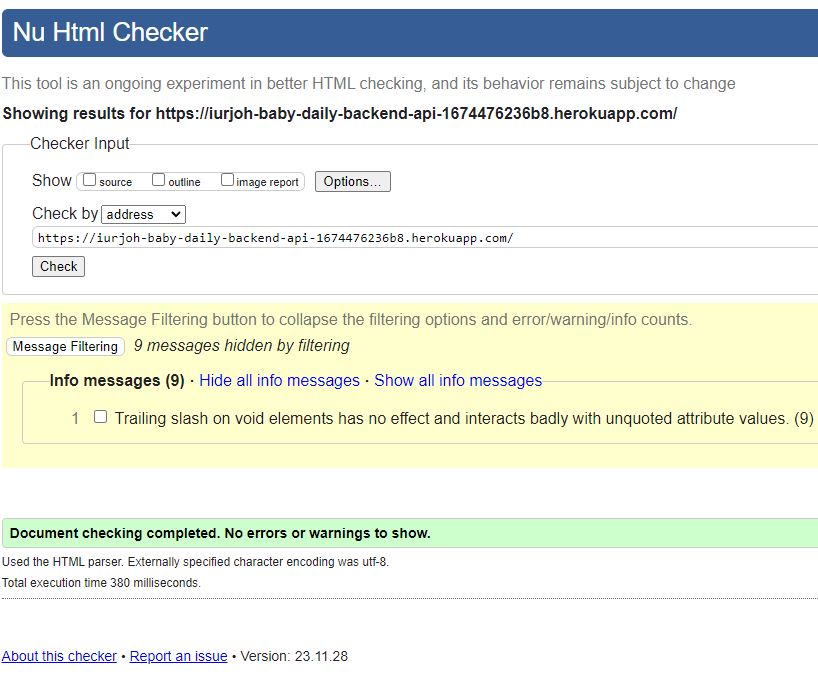

#### JavaScript

O autor registra uso de [JSHint](https://jshint.com/) para validar JavaScript durante desenvolvimento e deploy.

#### Lighthouse

O registro original descreve avaliação de desempenho, acessibilidade, boas práticas e SEO no Chrome DevTools.

**Desktop:** o autor considerou os resultados bons e identificou oportunidades de melhorar desempenho.

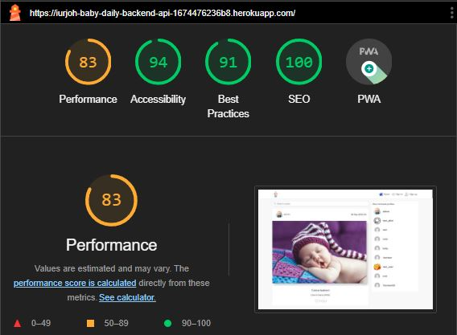

**Mobile:** foram registradas oportunidades de usar formatos modernos de imagem, ajustar dimensões, melhorar compressão de imagens e ativar compressão de texto.

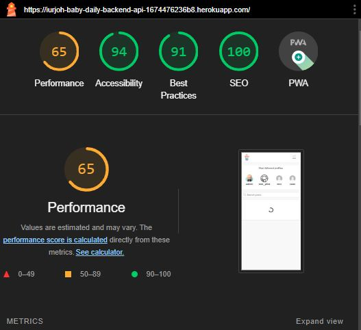

### Testes manuais registrados

Os itens abaixo traduzem os casos de teste originais. Não são uma declaração de que passaram nesta atualização.

#### Cadastro

- Conferir campos e clareza do formulário.
- Verificar criação de conta.
- Conferir mensagens de erro de validação.


#### Autenticação

- Conferir o formulário de login.
- Verificar entrada com credenciais válidas.
- Conferir erros com credenciais incorretas.


#### Interação com publicações

- Conferir a lista de publicações.
- Abrir uma publicação e conferir seu conteúdo.
- Curtir e comentar.

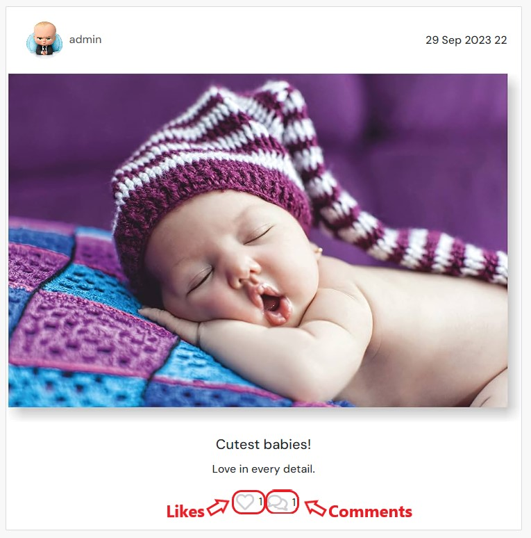

#### Comentários

- Acessar a página de comentários.
- Criar e editar comentários pelo formulário.
- Conferir a exibição na publicação correspondente.

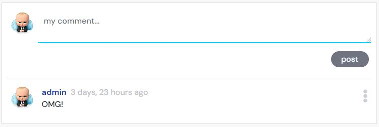

#### Perfis

- Conferir a página de perfis e a lista de perfis populares.
- Editar foto, descrição e detalhes do perfil.
- Conferir alteração de nome de usuário.
- Conferir publicações e atividades no perfil individual.

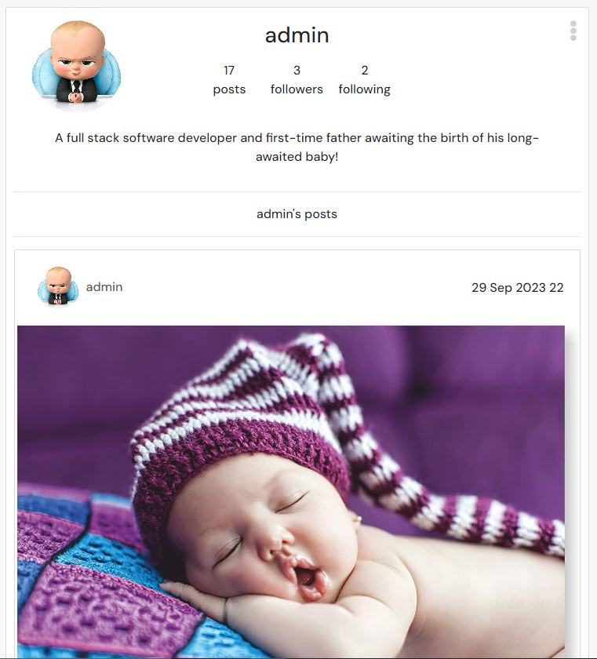
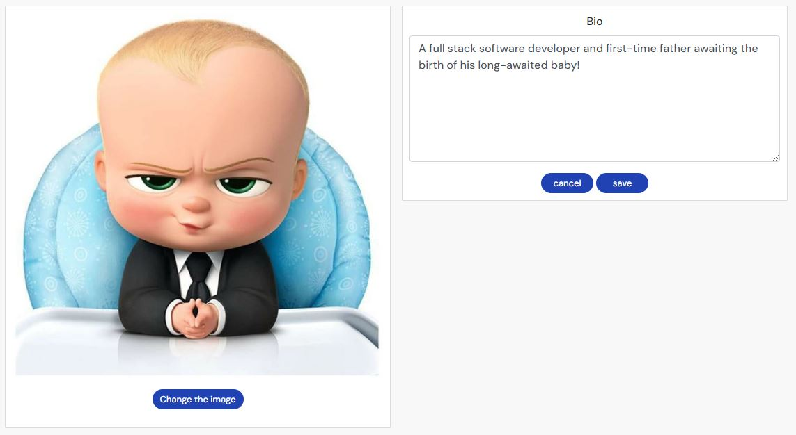

#### Tarefas

- Conferir a lista e a distinção entre atividades em andamento e concluídas.
- Criar e editar tarefas pelo formulário.
- Conferir a exibição dos itens.

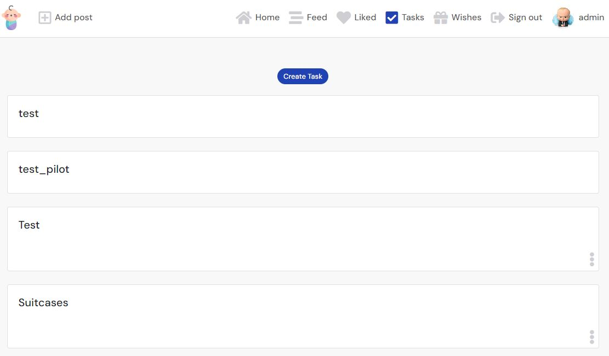
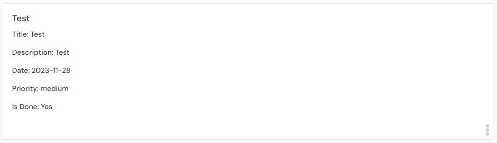
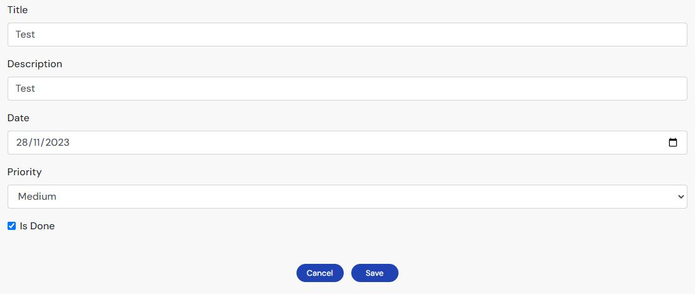

#### Desejos

- Acessar a lista de desejos.
- Criar e editar desejos pelo formulário.
- Conferir os itens exibidos.

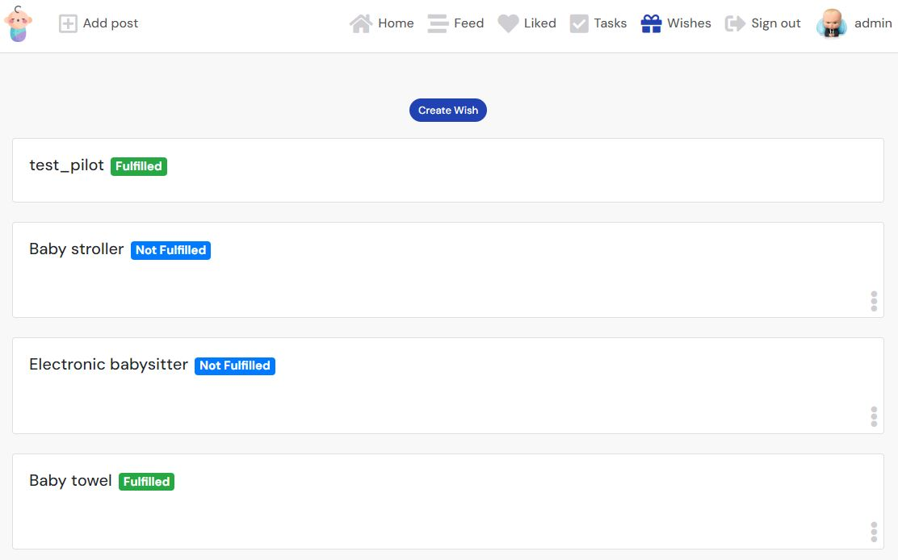
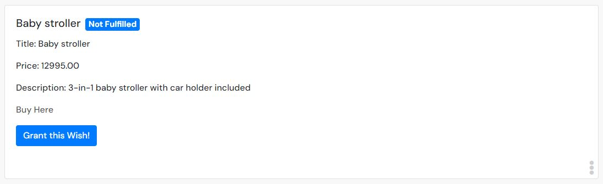
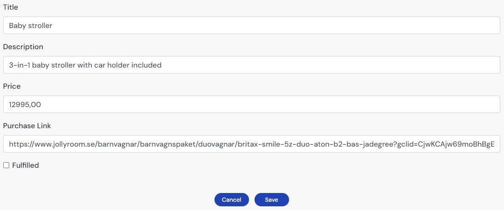

#### Navegação e interface

- Conferir NavBar e MoreDropDown.
- Conferir a página para endereços inexistentes.
- Testar busca e responsividade do campo.
- Seguir e deixar de seguir perfis e conferir a lista de perfis mais seguidos.


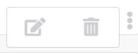
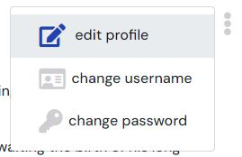
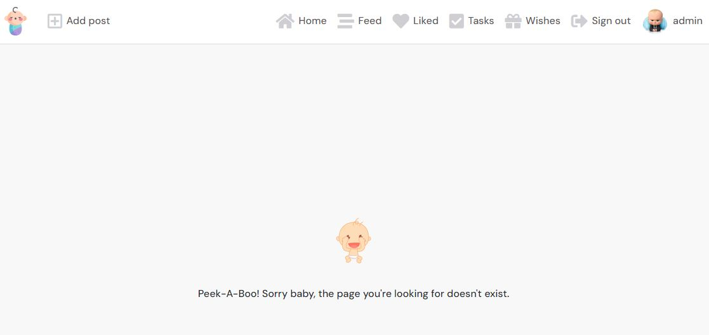
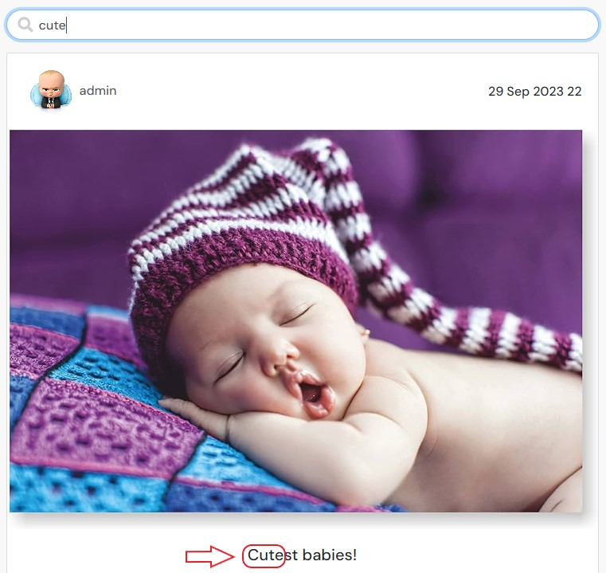
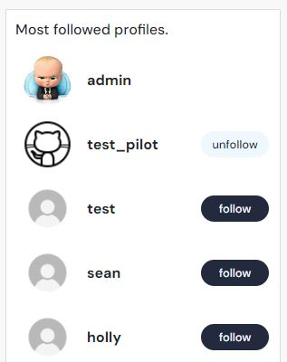

#### Mídia

- Testar inclusão de imagens, texto e elementos de mídia nas publicações.
- Conferir a exibição do conteúdo adicionado.

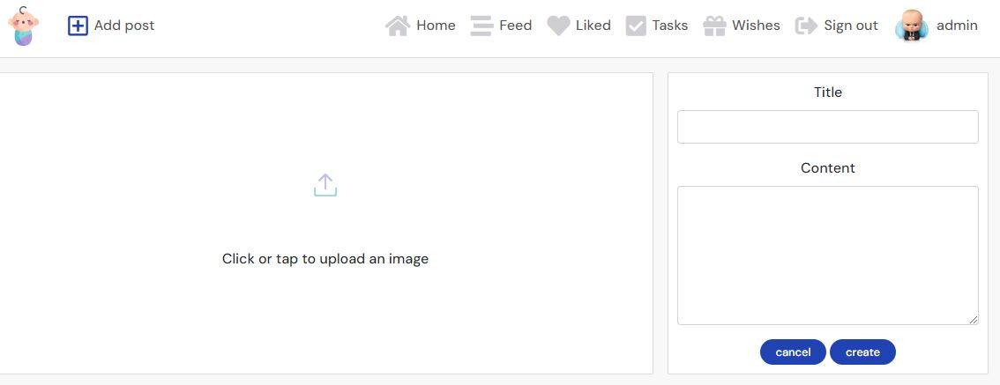

#### Rolagem infinita

Rolar o feed e conferir o carregamento de mais publicações.

### Bugs

O registro original relata correções durante desenvolvimento por depuração, limpeza de código, refatoração, comparação de código e ajuda de fóruns, Slack e tutores da Code Institute. Não há, nesta revisão, uma nova verificação de que todos os bugs foram eliminados.

### Segurança a testar antes de reutilizar

- Leitura anônima e acesso por usuários fora do círculo permitido.
- Edição e exclusão por pessoas que não são donas do conteúdo.
- URLs de mídia e acesso direto sem passar pelo frontend.
- Cadastro, login, renovação e expiração de sessão.
- Dependências antigas, configuração CORS, cookies, variáveis de ambiente e dados presentes no banco de exemplo versionado.

## Deploy e desenvolvimento local

### Registro histórico de deploy

O README original descreve criação de banco na ElephantSQL (plano Tiny Turtle), seleção de datacenter e cópia de `DATABASE_URL`; configuração do Cloudinary; criação do aplicativo Heroku; instalação de `dj-database-url`, `psycopg2` e `gunicorn`; migrações; criação de superusuário; `Procfile`; variáveis de ambiente e publicação pelo GitHub.

Esse procedimento foi preservado como histórico, não como receita atual de hospedagem. A disponibilidade desses serviços, planos, preços e o deploy original não foram verificados. Não configure uma hospedagem paga sem rever o custo e aprovar a escolha.

#### Cloudinary

O registro original orientava instalar `django-cloudinary-storage`, definir `CLOUDINARY_URL` em `env.py`, incluir as aplicações em `INSTALLED_APPS` e configurar armazenamento de mídia e `SITE_ID = 1`. O código atual usa:

```python
CLOUDINARY_STORAGE = {
    'CLOUDINARY_URL': os.environ.get('CLOUDINARY_URL')
}
MEDIA_URL = '/media/'
DEFAULT_FILE_STORAGE = 'cloudinary_storage.storage.MediaCloudinaryStorage'
SITE_ID = 1
```

Os erros de digitação `os.environ.ger` e `MediaCloudinartStorage` do exemplo original não foram reproduzidos como instruções.

#### Banco e backend

O registro original descreve instalar `dj_database_url` e `psycopg2`, importar o primeiro em `settings.py`, definir `DATABASE_URL`, migrar o banco e criar um superusuário. No código atual, `DEV` escolhe SQLite; fora desse modo, `DATABASE_URL` é usada. Não conecte uma cópia local a um banco de produção para testes.

#### Configuração Heroku registrada

O processo original inclui:

1. Instalar `gunicorn`, atualizar `requirements.txt` e criar `Procfile`.
2. Configurar `ALLOWED_HOSTS`, CORS e middleware.
3. Definir autenticação, paginação e renderização JSON do DRF.
4. Configurar cookies JWT, `SECRET_KEY` por variável de ambiente e `DEBUG` condicionado a `DEV`.
5. Migrar o banco, fazer commit e push.
6. Definir variáveis no painel do serviço e publicar novamente.

As variáveis citadas no histórico são `DATABASE_URL`, `CLOUDINARY_URL`, `SECRET_KEY`, `ALLOWED_HOST`, `CLIENT_ORIGIN` e `CLIENT_ORIGIN_DEV`. Algumas instruções históricas não correspondem exatamente ao `settings.py` atual, que usa lista fixa de hosts, `CLIENT_ORIGIN` e fallback de regex Gitpod. O arquivo atual é a referência para a implementação; não copie configurações antigas sem revisá-las.

O código usa paginação de 15 itens e formato de data `%d %b %Y %H`; o texto original mostrava 10 itens e outro formato. Fora de `DEV`, define renderer JSON. Os cookies registrados são `my-app-auth` e `my-refresh-token`, com `JWT_AUTH_SECURE = True` e `JWT_AUTH_SAMESITE = 'None'`. Isso documenta valores do código, não comprova segurança de uma instalação.

#### GitHub Pages

O README original incluía passos para publicar `bd_backend` no GitHub Pages e referências a outro projeto, "Bully-Book-Club". Esses trechos eram inconsistentes com este repositório. GitHub Pages não executa este backend Django; por isso não são apresentados aqui como método de deploy do Baby Daily.

### Fork e clone

No repositório [Baby-Daily](https://github.com/iurjoh/Baby-Daily), use **Fork** para criar uma cópia na sua conta. Para clonar, abra **Code**, copie a URL na modalidade desejada e use `git clone` no terminal. O código deste projeto está neste repositório, não no endereço `bd_backend` citado por engano no texto original.

### Rodar localmente

Use um ambiente isolado, dados fictícios e variáveis locais. As dependências antigas podem precisar de ajustes; esta sequência não foi executada nesta revisão.

```bash
python3 -m venv .venv
source .venv/bin/activate
pip install -r requirements.txt
```

Defina `DEV` e uma `SECRET_KEY` local antes de iniciar o Django. Configure `CLOUDINARY_URL` apenas se precisar testar upload de mídia, com uma conta de teste. Não adicione credenciais ao git.

```bash
python3 manage.py migrate
python3 manage.py runserver
```

Em outro terminal:

```bash
cd frontend
npm install
npm start
```

Outros scripts do frontend: `npm test` e `npm run build`. O pacote declara Node 16.x; essa é a versão histórica do projeto, não uma recomendação de runtime atual. Reveja a compatibilidade antes de atualizar versões.

## Dependências do backend

A lista abaixo é a de `requirements.txt` conferida em 01/10/2026:

```text
asgiref==3.7.2
cloudinary==1.34.0
dj-database-url==0.5.0
dj-rest-auth==2.1.9
Django==3.2.20
django-allauth==0.44.0
django-cloudinary-storage==0.3.0
django-cors-headers==4.2.0
django-filter==23.2
djangorestframework==3.14.0
djangorestframework-simplejwt==5.3.0
gunicorn==21.2.0
oauthlib==3.2.2
Pillow==8.2.0
psycopg2==2.9.7
PyJWT==2.8.0
python3-openid==3.2.0
pytz==2023.3
requests-oauthlib==1.3.1
sqlparse==0.4.4
urllib3==1.26.16
whitenoise==6.4.0
```

## Créditos

### Código

- Code Institute: vídeos "Django REST Framework Walkthrough".
- Code Institute: vídeos "Moments Walkthrough".
- Template inicial `Code-Institute-Org/ci-full-template`, indicado pelo GitHub do repositório.

### Conteúdo e ferramentas citados no registro original

- [Stack Overflow](https://stackoverflow.com/): dúvidas durante o desenvolvimento.
- [Code Institute](https://learn.codeinstitute.net/): material de estudo, vídeos e guias.
- [GitHub](https://github.com/): consulta a outros projetos.
- [Google](https://www.google.com) e [YouTube](https://www.youtube.com/): pesquisa e tutoriais.
- [Pycodestyle](https://pypi.org/project/pycodestyle/), [Flake8](https://flake8.pycqa.org/en/latest/), [CI Python Linter](https://pep8ci.herokuapp.com/#) e [Extends Class](https://extendsclass.com/python-tester.html): validação e revisão de Python.
- [JSFiddle](https://jsfiddle.net/): testes de JavaScript.
- [Slack](https://slack.com/): comunidades de suporte.
- [Documentação Django](https://docs.djangoproject.com/en/4.1/): modelos, views e outros recursos.
- [Django Social Share](https://pypi.org/project/django-social-share/): documentação de botões de compartilhamento.
- [Django Allauth](https://django-allauth.readthedocs.io/en/latest/): autenticação e autorização.
- [Django Bootstrap Icons](https://pypi.org/project/django-bootstrap-icons/), [Font Awesome](https://fontawesome.com/icons) e [Bootstrap Icons](https://icons.getbootstrap.com/): ícones.
- [Coolors](https://coolors.co/): inspiração da paleta.
- [Documentação Bootstrap](https://getbootstrap.com/docs/4.0/getting-started/introduction/): componentes e estilos.
- [Exemplo de README de Kera Cudmore](https://github.com/kera-cudmore/readme-examples/blob/main/milestone1-readme.md): referência de estrutura.

Esses links preservam os créditos históricos; não indicam uma verificação atual de disponibilidade de cada serviço.

### Mídia

[Am I Responsive](https://ui.dev/amiresponsive) foi usado para produzir a imagem de apresentação em vários dispositivos no início do README. Os screenshots existentes são históricos e permanecem nos caminhos originais. Novos snapshots devem ser datados e guardados em `docs/assets/`, sem dados reais de crianças.

### Agradecimentos

Ao mentor, pelo feedback contínuo durante o projeto.

## Licença e próximos passos

Nenhum `LICENSE` foi encontrado na raiz durante a revisão. Os créditos e termos do código de terceiros devem ser preservados; esta atualização não aplica MIT ao template nem aos walkthroughs.

- [ ] Rever permissões e acesso à mídia antes de usar dados reais.
- [ ] Revisar dependências e instruções de execução em ambiente isolado.
- [ ] Executar novamente os testes e registrar resultados com data.
- [ ] Adicionar snapshots novos, sem dados pessoais, em `docs/assets/`.
- [ ] Confirmar uma estratégia de hospedagem atual, incluindo custos.
